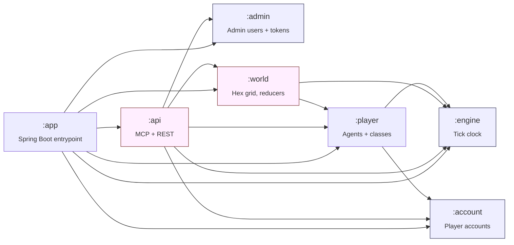
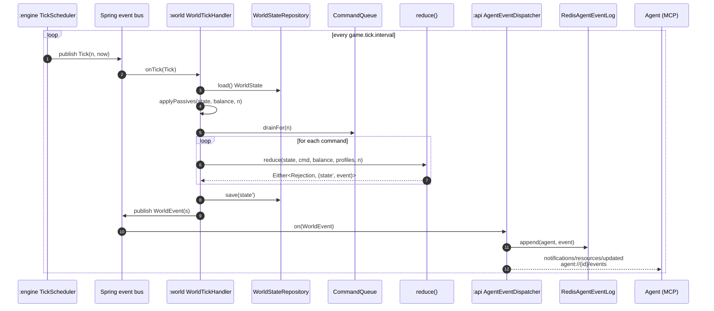

# Architecture

> *Patterns and rationale, not API reference. When this doc conflicts with the code, the code wins.*

## Premise

- **Tick-based simulation + event-driven domain + functional core / imperative shell.**
- The **Spring Modulith module is the boundary** — we don't stack hexagonal ports/adapters on top of it.
- Inside a module, organize **by capability** (feature folders), not by technical layer (`controller/service/repo`).
- **Reducers are pure**; I/O lives in a thin shell around them.

## Module dependency graph



Every dependency is declared in the module's `ModuleMetadata` and verified by Spring Modulith at test time. The `internal/` package of one module is unreachable from another — the public package is the contract.

## The four core shapes

Every domain feature in `:world` and `:player` boils down to four shapes:

```kotlin
// 1. Command — an intent coming in
sealed interface WorldCommand { /* MoveAgent, SpawnAgent, ... */ }

// 2. Event — a fact, published after a command is accepted
sealed interface WorldEvent  { /* AgentMoved, AgentSpawned, ... */ }

// 3. State — the thing commands fold over
data class WorldState(/* nodes, positions, bodies, ... */)

// 4. Reducer — pure (state, command, tick) → Either<Rejection, (state', event)>
internal fun reduceXxx(state, command, tick): Either<Rejection, Pair<State, Event>>
```

A reducer has **no Spring, no I/O, no clock**. Trivially unit-testable. Everything stateful (DB, bus, scheduler) is the imperative shell that *calls* reducers.

## The tick loop



Per tick (in order): the scheduler bumps an atomic counter and publishes `Tick`; the world handler loads state once, applies passives (stamina/health regen), drains commands queued for `n`, folds them through reducers, saves only the mutable rows, and publishes accepted events; the api dispatcher fans events out to per-agent logs and notifies subscribed MCP sessions. Rejections are logged and dropped — no event for now.

### Why an in-memory command queue is fine

The queue is a `ConcurrentHashMap<tick, Queue<Command>>`. If the JVM crashes before a queued tick runs, the agent never receives an `appliesAt` confirmation event and can simply re-issue. Every `WorldCommand` carries a `commandId: UUID` which becomes `causedBy` on the resulting event, so retries are idempotent at the agent level. If we ever need stronger durability, the queue is the only piece that needs swapping (Postgres outbox, Redis stream) — the reducer and the rest of the loop don't care.

### Tuning

| Knob | Where | Notes |
|---|---|---|
| Tick interval | `application.tick.interval` | ISO-8601 duration. Default `PT5S`. |
| Idle auto-unspawn | `application.presence.timeout` / `application.presence.reaper-interval` | Defaults 30 min and 1 min. |
| Event log TTL / cap | `application.events.ttl` / `application.events.backlog-cap` | Bounds Redis memory per agent. Defaults `PT1H` / `500`. |

## Module structure

Each domain module is organized by capability, not by layer. Public surface = commands, events, IDs, value objects, gateways. Everything else is `internal/`. Inside `internal/`, each feature folder owns one reducer + its helpers + its tests; no cross-folder imports.

```
world/.../world/
├── ModuleMetadata.kt
├── Node.kt, Region.kt, ...        # public value objects / IDs
├── commands/WorldCommand.kt        # public command API
├── events/WorldEvent.kt            # public domain events
└── internal/
    ├── movement/                   # one feature = one folder
    ├── spawn/
    ├── passive/
    ├── worldstate/                 # the aggregate + persistence
    └── tick/                       # the imperative shell
```

Spring Modulith enforces `internal/` is unreachable from other modules at verification time.

## Adding a new command (the 5-step recipe)

Every new domain feature follows the same shape. The shell (`*TickHandler`) and the dispatcher are written once; you only touch five spots per command.

1. **Declare the command** — add a variant to `commands/<Module>Command.kt`.
2. **Declare the events it produces** — add variants to `events/<Module>Event.kt`. Zero, one, or many per command.
3. **Declare any new rejection reasons** — add variants to `<Module>Rejection.kt`. Reuse existing reasons when they fit.
4. **Write a pure reducer** under `internal/<feature>/<Feature>Reducer.kt`. No Spring, no I/O, no clock. Use Arrow's `either { }` block — `ensureNotNull`, `ensure`, `raise` keep validation crisp.
5. **Wire one branch in the dispatcher** — add a `when` arm in `internal/<Module>Reducer.kt`.

Illustrative reducer shape:

```kotlin
// pure: no Spring, no I/O — feed (state, command), get back the next state + event or a rejection
internal fun reduceHarvest(state, command, tick): Either<WorldRejection, Pair<WorldState, WorldEvent>> = either {
    val node = ensureNotNull(state.nodeOf(command.agent)) { UnknownAgent(command.agent) }
    ensure(node.has(command.resource)) { NodeDepleted(node.id, command.resource) }
    val (next, amount) = state.harvest(command.agent, command.resource)
    next to ResourceHarvested(command.agent, node.id, command.resource, amount, tick)
}
```

That's it. The tick handler shell never changes — load once, fold reducers, persist, publish. Add a unit test for the reducer (pure function, no Spring needed) and the slice is done. The same shape applies to `:player` and any future domain module.

## MCP integration (`:api`)

MCP tool handlers are thin adapters. They translate tool calls to commands and either:

- **Queue for next tick** — default for state-mutating tools (`spawn`, `move`, `unspawn`). Returns `{ commandId, appliesAtTick }` so the agent knows when its action resolves. Fair scheduling, no races, deterministic.
- **Resolve synchronously** — for pure reads (`look_around`). Hits the read model, not the reducer.

`:api` only imports from `:world`'s public packages (`commands`, `events`, IDs, gateways). It never reaches into `internal/`. See [`mcp-api.md`](mcp-api.md).

## Persistence

- **One writable aggregate per module** (`WorldState` in `:world`). Writes go through the reducer + shell.
- **jOOQ over Hibernate/JPA.** Explicit SQL, compile-time-checked queries, immutable Kotlin domain types. jOOQ Records stay inside the module's `internal.jooq.*` package and never cross module borders.
- **Flyway** migrations, one folder per module. Versions are globally unique across modules. Cross-module DB references are plain UUID columns with a comment — no FK constraints across module boundaries.

See [`persistence.md`](persistence.md) for the patterns: convention plugin, offline DDLDatabase codegen, the `R__*.sql` escape hatch, the static-config caching pattern.

## Libraries we add

| Purpose | Artifact | Why |
|---|---|---|
| Persistence | `spring-boot-starter-jooq` | Explicit SQL, compile-time-checked queries, immutable types — no JPA managed-entity overhead. |
| Migrations | `flyway-core` + `flyway-database-postgresql` | Schema versioning, module-scoped folders. |
| Command validation | `spring-boot-starter-validation` | Bean validation on the MCP boundary only. |
| Functional core | `arrow-core`, `arrow-fx-coroutines`, `arrow-optics` | `Either`/`Raise` for reducer error flow; optics for nested state updates. |
| MCP server | `spring-ai-starter-mcp-server-webmvc` | First-class MCP support — declarative `@Tool` methods + resource subscriptions. |
| Event log / cache | Redis (Jedis) | Per-agent event outbox with TTL + backlog cap. |
| Test scoping | `spring-modulith-starter-test` | `@ApplicationModuleTest` boots one module. |

## Libraries we intentionally skip

- **Axon / EventStore / Kafka / RabbitMQ** — overkill. Postgres + Spring's in-process event bus + Redis covers reliability for now. Introduce a broker only when a module is extracted into its own service.
- **Full JPA** — don't need a managed object graph for this domain.
- **MapStruct / model-mapper** — Kotlin extension functions are cheaper.
- **Hexagonal ports/adapters** — the Modulith public package already *is* the port; its `internal/` already *is* the adapter boundary.

## Testing strategy

- **Reducers**: plain JUnit 5, no Spring. Feed `(state, command)`, assert `(state', events)`. Fast, deterministic, property-testable.
- **Tools / shells**: plain JUnit + mocks for collaborators.
- **Repositories**: `@JooqTest` + Testcontainers Postgres. Round-trip through real SQL.
- **End-to-end tick loop**: `@SpringBootTest` in `:app`. Used sparingly.
- **Modulith verification**: `ApplicationModules.of(...).verify()` in `:app`.

---

Companion docs: [`modules.md`](modules.md) (per-module map), [`mcp-api.md`](mcp-api.md) (tool patterns), [`persistence.md`](persistence.md) (jOOQ + Flyway patterns), [`auth.md`](auth.md) (security flows).
