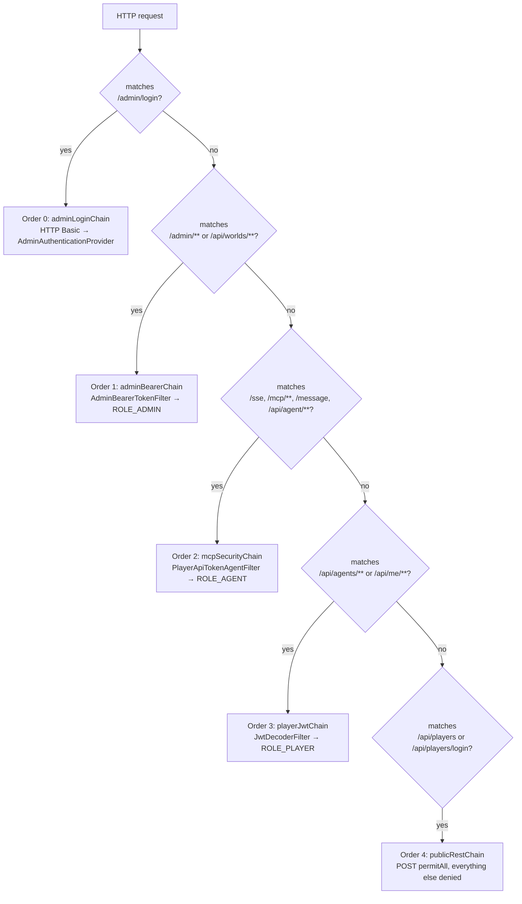
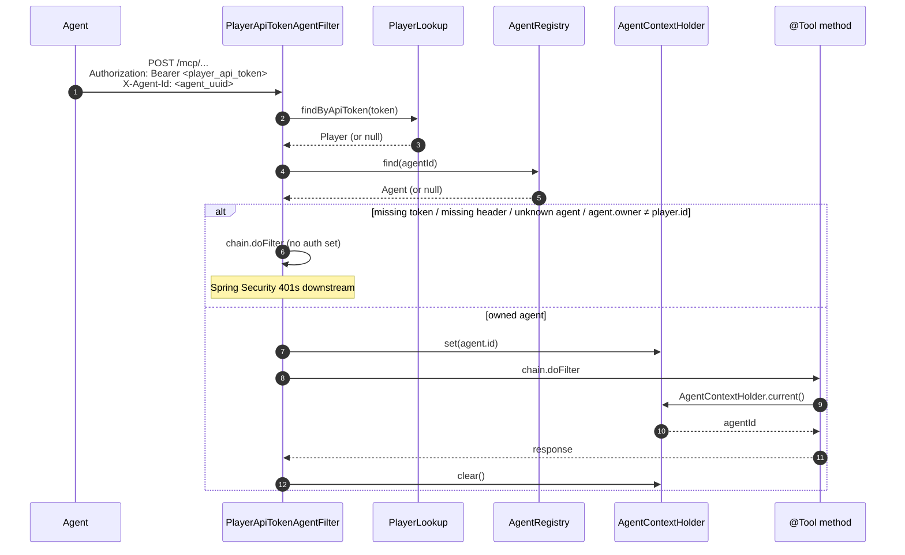

# Auth

> *Patterns and rationale, not API reference. When this doc conflicts with the code, the code wins.*

Three principals exist in the system: **Player** (a human user), **Admin** (an operator with editor + management access), and **Agent** (an AI process the player drives). All three live in their own module (`:account`, `:admin`, `:player`); `:api` provides the HTTP entry points.

A Player owns one **API token** (a long-lived opaque secret) and can authenticate to REST endpoints via **JWT** (issued from username/password). The same player API token is reused for every agent the player owns — the agent identity is supplied per call via the `X-Agent-Id` header, and the server enforces `agent.owner == player.id` on every MCP call.

## The five-chain pattern

`SecurityConfig` declares five `SecurityFilterChain` beans, executed in declared order. The first chain whose `securityMatcher` matches handles the request — they don't compose, they dispatch.



Why one chain per principal instead of one chain with branching: each chain configures stateless session policy, CSRF, CORS, and authentication entry-point independently — colocating all of that in a single chain becomes unreadable. The matcher does the routing.

All chains are stateless (no cookies → CSRF disabled). `OPTIONS /**` is `permitAll` on every chain so browser preflight always passes.

## Bearer / JWT filters fall through; `authenticated()` rejects

A subtle but load-bearing rule: the bearer-token and JWT filters **don't 401 on missing/invalid tokens**. They simply leave the `SecurityContext` empty and let the chain continue. The chain's authorization rule (`.authenticated()` or role check) is what produces the 401.

This keeps each filter single-purpose (token → principal, no rejection logic) and makes every endpoint's auth requirement visible at chain configuration, not buried in a filter.

## `AgentContextHolder` — the ThreadLocal the MCP filter sets and clears

Tool handlers don't take an `AgentId` parameter. The MCP filter resolves the player api token + `X-Agent-Id` header, validates the agent belongs to the player, and stashes the agent id in `AgentContextHolder` (a `ThreadLocal<AgentId>`) for the duration of the request. Tools call `AgentContextHolder.current()` instead of threading the id through every signature.

The filter is responsible for both **setting and clearing** the ThreadLocal. The `try/finally` is load-bearing — leaking a `ThreadLocal` in a Tomcat thread pool means the next request on that thread sees the previous request's agent id. Always:

```kotlin
// illustrative shape — set on entry, clear on exit, no exceptions
try {
    AgentContextHolder.set(agent.id)
    SecurityContextHolder.getContext().authentication = authFor(agent)
    chain.doFilter(req, res)
} finally {
    AgentContextHolder.clear()
    SecurityContextHolder.clearContext()
}
```

## Admin login → bearer token

`POST /admin/login` accepts HTTP Basic, the `adminLoginChain` authenticates via `AdminAuthenticator` (constant-time bcrypt compare), and on success the controller calls `AdminTokenStore.issue(adminId)` and returns `{ "token": "..." }`. The token is a random 128-char string persisted in `admin_tokens`, so it survives restarts. Bootstrap: if the table is empty on startup and `ADMIN_BOOTSTRAP_USERNAME` / `ADMIN_BOOTSTRAP_PASSWORD` are set, the env-var bootstrapper seeds the first admin.

Subsequent admin requests carry `Authorization: Bearer <token>`; `AdminBearerTokenFilter` looks the token up and grants `ROLE_ADMIN`.

## Player login → JWT

`POST /api/players/login` accepts a JSON body `{ username, password }`. `PlayerLoginController` verifies via `AccountAuthenticator` and on success returns `{ "token": "<jwt>" }`. The JWT is HS256-signed, contains `sub = playerId` and an `exp` (default 24h), and is **not** persisted server-side — verification only needs the secret.

Configure via:

- `application.security.jwt.secret` — HMAC secret. **Must** be ≥ 32 bytes in any non-dev environment. Read from env var `SECURITY_JWT_SECRET`.
- `application.security.jwt.ttl` — token lifetime, ISO-8601 `Duration` (default `PT24H`).

Subsequent player REST requests carry `Authorization: Bearer <jwt>`; `JwtDecoderFilter` parses + verifies, loads the `Player` from `PlayerLookup`, and grants `ROLE_PLAYER`.

## Player API token — the MCP credential

Each player has exactly one **API token** (`players.api_token`, prefixed `plr_`) minted at registration and returned in the registration response. It's the credential every MCP tool call carries. Players can rotate it (invalidating any agents currently connected); the JWT issued at login is independent and unaffected by rotation.

## Agent MCP call (player api token + X-Agent-Id)



The ownership check is the load-bearing invariant: a stolen player api token cannot drive agents that don't belong to its owner, because every call must specify which agent and the filter rejects mismatches.

## Public endpoints

`POST /api/players` (registration) and `POST /api/players/login` are the only `permitAll` endpoints. The `publicRestChain` matches them explicitly and `denyAll`s everything else under those paths so a misconfigured route can't accidentally become anonymous.
