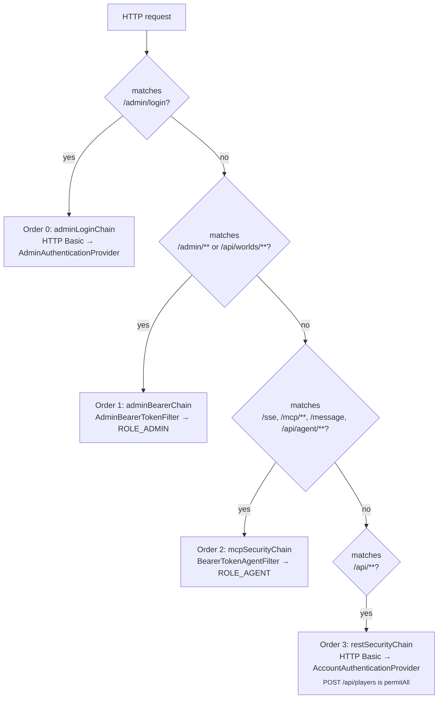
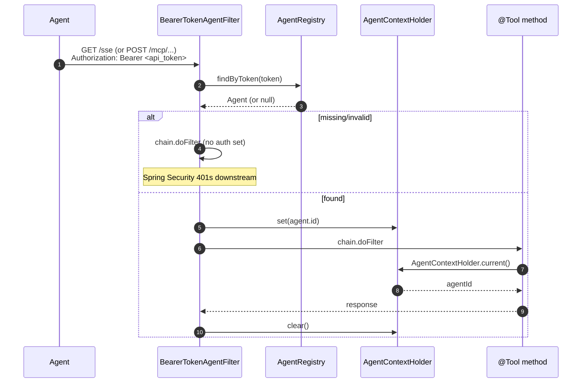

# Auth

> *Patterns and rationale, not API reference. When this doc conflicts with the code, the code wins.*

Three principals exist in the system: **Player** (a human user), **Admin** (an operator with editor + management access), and **Agent** (an AI process holding an api token issued to a Player). All three live in their own module (`:account`, `:admin`, `:player`); `:api` provides the HTTP entry points.

## The four-chain pattern

`SecurityConfig` declares four `SecurityFilterChain` beans, executed in declared order. The first chain whose `securityMatcher` matches handles the request — they don't compose, they dispatch.



Why one chain per principal instead of one chain with branching: each chain configures stateless session policy, CSRF, CORS, and authentication entry-point independently — colocating all of that in a single chain becomes unreadable. The matcher does the routing.

All chains are stateless (no cookies → CSRF disabled). `OPTIONS /**` is `permitAll` on every chain so browser preflight always passes.

## Bearer filters fall through; `authenticated()` rejects

A subtle but load-bearing rule: the two bearer-token filters (admin and agent) **don't 401 on missing/invalid tokens**. They simply leave the `SecurityContext` empty and let the chain continue. The chain's authorization rule (`.authenticated()` or role check) is what produces the 401.

This keeps the filter logic single-purpose (token → principal, no rejection logic) and makes every endpoint's auth requirement visible at chain configuration, not buried in a filter.

## `AgentContextHolder` — the ThreadLocal the bearer filter sets and clears

Tool handlers don't take an `AgentId` parameter. The bearer filter resolves the token, looks up the agent, and stashes the id in `AgentContextHolder` (a `ThreadLocal<AgentId>`) for the duration of the request. Tools call `AgentContextHolder.current()` instead of threading the id through every signature.

The filter is responsible for both **setting and clearing** the ThreadLocal. The `try/finally` is load-bearing — leaking a `ThreadLocal` in a Tomcat thread pool means the next request on that thread sees the previous request's agent id. Always:

```kotlin
// illustrative shape — set on entry, clear on exit, no exceptions
try {
    AgentContextHolder.set(agent.id)
    SecurityContextHolder.getContext().authentication = authFor(agent)
    chain.doFilter(req, res)
} finally {
    AgentContextHolder.clear()
    SecurityContextHolder.clearContext()
}
```

## Admin login → bearer token

`POST /admin/login` accepts HTTP Basic, the `adminLoginChain` authenticates via `AdminAuthenticator` (constant-time bcrypt compare), and on success the controller calls `AdminTokenStore.issue(adminId)` and returns `{ "token": "..." }`. The token is a random 128-char string persisted in `admin_tokens`, so it survives restarts. Bootstrap: if the table is empty on startup and `ADMIN_BOOTSTRAP_USERNAME` / `ADMIN_BOOTSTRAP_PASSWORD` are set, the env-var bootstrapper seeds the first admin.

Subsequent admin requests carry `Authorization: Bearer <token>`; `AdminBearerTokenFilter` looks the token up and grants `ROLE_ADMIN`.

## Agent bearer-token call (MCP and `/api/agent/**`)



Player auth (`POST /api/players` permits anonymous signup; everything else under `/api/**` not matched by an agent or admin chain uses HTTP Basic) follows the same Spring `AuthenticationProvider` pattern as admin login — see `AccountAuthenticationProvider` in `:api/internal/security/`.
