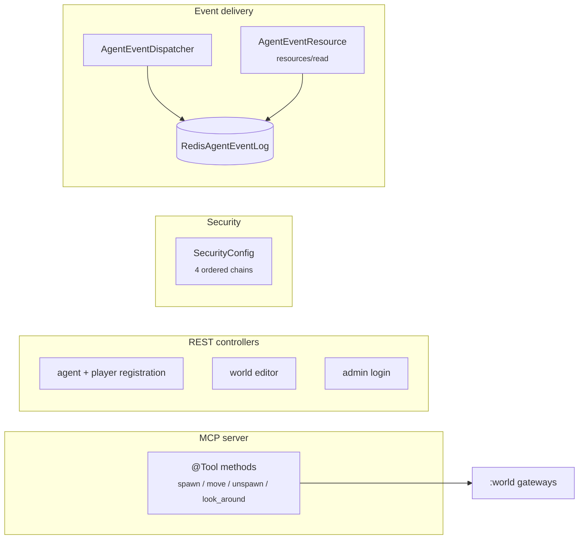

# Modules

> *Patterns and rationale, not API reference. When this doc conflicts with the code, the code wins.*

Each module is a Spring Modulith `@ApplicationModule`. Its public package is the only surface other modules may import; everything under `internal/` is hidden at compile time. Allowed dependencies are declared in the module's `ModuleMetadata` and verified at test time.

This doc gives the *role* and *boundary* of each module — not its public surface. For that, read the module's public package.

## :engine

The tick clock. Owns wall-clock time, an atomic counter, and a `@Scheduled` task that publishes `Tick` events. No persistence, no domain knowledge.

Allowed dependencies: none.

## :account

Human user accounts with bcrypt-hashed credentials. Knows nothing about agents or the world. Mirrors `:admin`'s shape — keep them aligned when changing one.

Allowed dependencies: none.

## :admin

Admin users + long-lived bearer tokens. Used by the world editor and any `/admin/**` endpoint. Same shape as `:account` (`Lookup`, `Authenticator`, `Registrar`) plus a `TokenStore` for issuing/revoking tokens. Bootstrapped from environment variables when the table is empty on startup.

Allowed dependencies: none.

## :player

Agents (the things AI prompts control), their owning player, and class metadata. An agent's `owner_id` is a soft reference to `:account.players` (UUID column, no FK — see [`persistence.md`](persistence.md) on cross-module references).

Allowed dependencies: `engine`, `account`.

## :world

The simulation. Hex grid + reducers + tick handler. The biggest module.

```mermaid
graph TB
    Cmds["commands/<br/>WorldCommand"] --> Q[CommandQueue]
    Q --> H[WorldTickHandler<br/><sub>@EventListener Tick</sub>]
    H --> Reducer[reduce - dispatcher]
    Reducer --> Slices["per-feature reducers<br/><sub>movement / spawn / passive / ...</sub>"]
    H --> Repo[WorldStateRepository]
    Repo --> SC[WorldStaticConfig<br/><sub>volatile cache</sub>]
    H --> Bus[Spring bus] -. WorldEvent .-> Listeners["external @EventListener<br/>(:api dispatcher)"]
    Editor["WorldEditingGateway"] -. seeds regions / nodes .-> SC
```

Three gateways form the public surface:

- **`WorldCommandGateway`** — `submit(command, appliesAtTick)`, used by MCP tools. Backed by the in-memory queue.
- **`WorldQueryGateway`** — synchronous read model for tools (location of an agent, node by id, nodes within radius, etc.). Backed by the static-config cache + DB for the mutable slice.
- **`WorldEditingGateway`** — editor write API (create world, paint biome/climate, seed hex grid). Reloads the static-config cache after each write so the runtime reflects edits without restart.

The module owns one writable aggregate (`WorldState`) and uses the **static-config + mutable-state** persistence pattern: regions and nodes are loaded once and cached; only positions and bodies are queried per tick.

Allowed dependencies: `engine`, `player`.

## :api

MCP server, REST endpoints, security. **Pure adapter — no domain logic, no public package.** Every type lives under `internal/`.



`:api`'s job is translation:
- MCP tool calls → `WorldCommand` queued for next tick (or sync read of `WorldQueryGateway`).
- `WorldEvent`s on the bus → per-agent log entries + MCP `notifications/resources/updated`.
- HTTP requests → calls into `:account` / `:admin` / `:player` / `:world`'s public surfaces.

Tool handlers don't take an `AgentId` parameter — the bearer-token filter resolves it from the token and stashes it in a `ThreadLocal` (`AgentContextHolder`). See [`auth.md`](auth.md).

Allowed dependencies: every other module.

## :app

Spring Boot entrypoint. The only `main()`. Owns `application.yaml` and runs Modulith's `ApplicationModules.of(...).verify()` in tests. Imports every other module so the boot context wires up the full graph.
