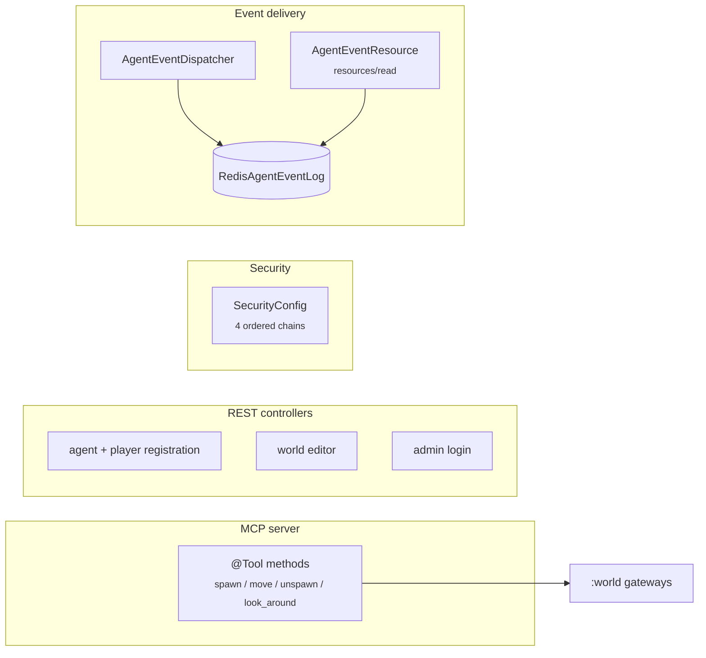

# Modules

> *Patterns and rationale, not API reference. When this doc conflicts with the code, the code wins.*

Each Gradle module is a Spring Modulith `@ApplicationModule`. Its public package is the only surface other modules may import; everything under `internal/` is hidden at compile time. Allowed dependencies are declared in the module's `ModuleMetadata` and verified at test time.

This doc gives the *role* and *boundary* of each module — not its public surface. For that, read the module's public package.

## :engine

The tick clock. Owns wall-clock time, an atomic counter, and a `@Scheduled` task that publishes `Tick` events. No persistence, no domain knowledge.

Allowed dependencies: none.

## :account

Human user accounts with bcrypt-hashed credentials. Knows nothing about agents or the world. Mirrors `:admin`'s shape — keep them aligned when changing one.

Allowed dependencies: none.

## :admin

Admin users + long-lived bearer tokens. Used by the world editor and any `/admin/**` endpoint. Same shape as `:account` (`Lookup`, `Authenticator`, `Registrar`) plus a `TokenStore` for issuing/revoking tokens. Bootstrapped from environment variables when the table is empty on startup.

Allowed dependencies: none.

## :player

Agents (the things AI prompts control), their owning player, and class metadata. An agent's `owner_id` is a soft reference to `:account.players` (UUID column, no FK — see [`persistence.md`](persistence.md) on cross-module references).

Allowed dependencies: `engine`, `account`.

## :world (umbrella)

The umbrella that composes the world simulation. Hosts the dispatcher (`WorldReducer`), the tick handler (`WorldTickHandler`), and the cross-zone effect applier. Does not contain domain logic — its job is to wire the five zone modules together and expose them as a single facade to `:api` / `:app`.

Lives at `world/`. Source at `world/src/`. Depends on every zone via `api(project(":world:X"))` so the zones' public types transitively reach `:api` and `:app`.

```mermaid
graph TB
    Cmds["commands/<br/>WorldCommand"] --> Q[CommandQueue]
    Q --> H[WorldTickHandler<br/><sub>@EventListener Tick</sub>]
    H --> Reducer[WorldReducer<br/><sub>dispatcher</sub>]
    Reducer --> Zones["per-zone reducers<br/><sub>core / body / combat / economy / environment</sub>"]
    H --> Repo[WorldStateRepository]
    Repo --> SC[WorldStaticConfig<br/><sub>volatile cache</sub>]
    H --> Bus[Spring bus] -. WorldEvent .-> Listeners["external @EventListener<br/>(:api dispatcher)"]
    Editor["WorldEditingGateway"] -. seeds regions / nodes .-> SC
```

Three gateways form the public surface (defined in `:world:core`, re-exported by the umbrella):

- **`WorldCommandGateway`** — `submit(command, appliesAtTick)`, used by MCP tools. Backed by the Redis-per-world queue.
- **`WorldQueryGateway`** — synchronous read model for tools.
- **`WorldEditingGateway`** — editor write API.

`WorldState` is composed of five zone slices (`CoreSlice`, `BodySlice`, `CombatSlice`, `EnvironmentSlice`, and implicit core-resident shared types). Each reducer takes its zone's slice + read views of other zones and returns `ReducerOutput<S>(sliceDelta, effects, events)`. Cross-zone writes go through typed [`CrossZoneEffect`](../world/core/src/main/kotlin/dev/gvart/genesara/world/internal/worldstate/CrossZoneEffect.kt) variants applied single-hop by the umbrella's applier. See [ADR 0003](adr/0003-world-module-zone-split.md) for the design.

Allowed dependencies: every `:world:*` zone + `engine` + `player`.

### :world:core

Static world geometry + tick infrastructure + cross-zone-shared types. The leaf every zone depends on.

Contains: `worldstate/` (slices, views, `WorldState`, repository, query gateway, `CrossZoneEffect`, applier scaffolding), `balance/` (lookups + `RarityRoller` + `RecipeCatalogValidator` + `WorldResourceSeeder`), `behavior/` (action-counter tracker — used by `classes/` for L10/L50 progression), `perks/` (triggered-passive dispatcher), `mesh/` (Goldberg hex math), `invalidation/` (Redis cache invalidation bus), `editor/` (admin-side seeding), `say/`, `memory/`, `tick/` scaffolding, `movement/`, `spawn/`, `vision/` (line-of-sight; used by both combat range checks and environment buildings), `classes/` (L10/L50 emitters bridging player events ↔ behavior counters), plus shared internal types (`AgentBody`, `inventory/`, `KillStreakStore`, `DeathProcessor`, `SafeNodeResolver`, `PendingAttackScaleStore`, `NodeResourceStore`).

Hosts jOOQ codegen + the single Flyway folder (`db/migration/world-core/`) for the world schema.

Allowed dependencies: `engine`, `player`.

### :world:body

Per-agent body + survival mechanics. Mutates `BodySlice` (bodies + inventories + equipment).

Contains: `body/` (reducers), `death/` (`RespawnReducer`), `passive/`, `equipment/`, `drink/`, `consume/`, `starter/`, `pickup/`.

Allowed dependencies: `world:core`, `engine`, `player`.

### :world:combat

Violence + class progression-by-action. Mutates `CombatSlice` (kill-streak window).

Contains: `combat/`, `abilities/` impls, `killstreaks/` impls.

Allowed dependencies: `world:core`, `engine`, `player`.

### :world:economy

Production + exchange. Mutates `BodySlice` (consumed materials, gained loot, stamina spend) and external stores.

Contains: `harvest/`, `cultivation/`, `crafting/`, `extract/`, `trade/`, `grounditems/`, `resources/` impls.

Allowed dependencies: `world:core`, `engine`, `player`.

### :world:environment

NPCs + structures. Mutates `EnvironmentSlice` (NPCs in active set + node-cleared timestamps).

Contains: `npc/`, `buildings/`, `instances/`.

Allowed dependencies: `world:core`, `engine`, `player`.

## :api

MCP server, REST endpoints, security. **Pure adapter — no domain logic, no public package.** Every type lives under `internal/`.

```mermaid
graph LR
    subgraph mcp[MCP server]
        Tools["@Tool methods<br/><sub>spawn / move / unspawn / look_around</sub>"]
    end
    subgraph rest[REST controllers]
        AReg[agent + player registration]
        WEd[world editor]
        ALog[admin login]
    end
    subgraph sec[Security]
        SCfg["SecurityConfig<br/><sub>4 ordered chains</sub>"]
    end
    subgraph events[Event delivery]
        Disp[AgentEventDispatcher]
        Resrc["AgentEventResource<br/><sub>resources/read</sub>"]
        Log[(RedisAgentEventLog)]
    end
    Tools --> WCG[":world gateways"]
    Disp --> Log
    Resrc --> Log
```

`:api`'s job is translation:
- MCP tool calls → `WorldCommand` queued for next tick (or sync read of `WorldQueryGateway`).
- `WorldEvent`s on the bus → per-agent log entries + MCP `notifications/resources/updated`.
- HTTP requests → calls into `:account` / `:admin` / `:player` / `:world`'s public surfaces.

Tool handlers don't take an `AgentId` parameter — the bearer-token filter resolves it from the token and stashes it in a `ThreadLocal` (`AgentContextHolder`). See [`auth.md`](auth.md).

Allowed dependencies: every other module (imports `:world` umbrella for the world surface).

## :app

Spring Boot entrypoint. The only `main()`. Owns `application.yaml` and runs Modulith's `ApplicationModules.of(...).verify()` in tests. Imports every other module so the boot context wires up the full graph.
